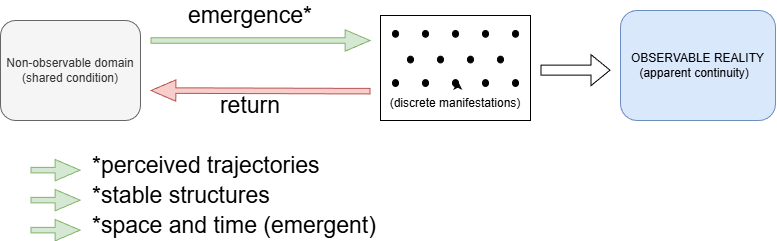

# The Quantum Genesis Theory

by Mauro Ghiglia

### Introduction

- This work does not originate from formal scientific training, but from a sustained attempt to reflect on the limits and assumptions of current scientific models.

  Modern science has achieved extraordinary precision in describing and predicting physical phenomena. However, by its empirical nature, it necessarily and deliberately limits itself to what can be observed, measured, and tested. This leaves open the possibility that certain aspects of reality — particularly those not directly accessible to observation — remain outside its scope.

  The purpose of this work is not to challenge or replace established scientific theories, but to explore whether a complementary conceptual framework can be formulated to address questions that remain only partially understood.

  The initial intuition behind this framework emerged while watching a well-known Italian scientist on television. He explained that if we push a bicycle and then let it go, we can predict that it will continue moving for a few seconds, and we can even calculate when it will eventually fall. However, beyond the mathematical description, a more fundamental question remains open: why does it continue to move at all? What is it that sustains this motion once the initial push is no longer applied? Is there an intrinsic “force” within the system, or are we simply describing the behavior without fully understanding its underlying mechanism?

  This observation highlights a broader issue: even in everyday phenomena, we often possess precise laws that describe behavior, yet the underlying nature of these processes remains conceptually unclear. This reflection constitutes one of the starting points of the present framework.

  In particular, this work focuses on phenomena such as:

  - gravity
  - mass
  - inertia
  - centrifugal phenomena

  These are well described mathematically, yet their deeper nature and underlying mechanisms are still subject to interpretation.

  There is also a more “philosophical” question that has always remained in the background of these reflections: **why do the Earth and the Moon attract each other?** Is there some kind of invisible “elastic” connecting them, or is this simply a way of describing an effect without accessing its true nature? And if such an attraction exists, could one in principle imagine a barrier capable of interrupting it, allowing the Moon to drift freely through space? These questions are not meant to challenge established physical laws, but to highlight the gap between our ability to describe interactions and our understanding of what fundamentally gives rise to them.

  The central intuition guiding this work is that what we perceive as stable physical reality may in fact be the result of continuous transitions of quanta between observable and non-observable states. Within this perspective, matter is not a fixed entity, but an intermediate manifestation of a more fundamental process.

  This approach does not claim completeness or finality. Rather, it aims to propose a coherent line of thought that may open alternative ways of interpreting physical phenomena, while remaining compatible with empirical observations.

## Core Assumptions

This framework is based on a limited set of foundational assumptions, each following logically from the previous, and intended to define the minimum structure required to describe the proposed model.

------

### 1. Nature of quanta

Modern physics describes matter as composed of quanta, but this raises a fundamental question: what is the nature of a quantum itself?

If a quantum is considered an object or unit of reality, it is natural to ask whether it is composed of parts, and if so, what those parts are. If it can be divided, it is not fundamental; if it cannot, it represents a limit beyond which the concept of “object” loses its conventional meaning.

This tension echoes philosophical considerations dating back to **Zeno of Elea**, who highlighted the paradoxes of infinite division. Any description of matter must implicitly assume a point at which further division is no longer meaningful.

Within the present framework, quanta are therefore not interpreted as small, persistent objects, but as **events or manifestations** that do not require internal composition in the traditional sense.

------

### 2. Non-stability of quanta

If quanta are understood as manifestations rather than persistent objects, their existence within observable reality is not continuous.

They are assumed to exist in a dynamic condition in which their presence is **intermittent**.

What we perceive as continuity of matter is therefore not the persistence of the same entity, but the result of a rapid and continuous process of appearance and disappearance.

------

### 3. Transitional nature of reality

Given the non-continuous presence of quanta, observable reality is interpreted as an **intermediate condition**, not as a final or stable state.

In this view:

- quanta emerge into the observable domain
- remain observable for a finite interval
- then return to a non-observable condition

This continuous process defines what is perceived as existence.

------

### 4. Existence of a non-observable domain

The intermittent manifestation of quanta implies the existence of a domain in which they exist when not observable.

This domain is not directly accessible to observation, rather than inherently non-physical.

It is not to be interpreted as empty space, but as a necessary condition that allows transitions between observable and non-observable states.

------

### 5. Generation of space and time

If quanta are not continuously present, space and time cannot be considered independent frameworks.

Instead, they are **emergent properties** resulting from the distribution and transitions of quanta.

Space is defined by the relative manifestation of quanta, and exists only while such manifestations occur. Time reflects the ordering of these transitions.

In the absence of quanta, there is no space to separate and no time to order events.

The apparent continuity of space and the flow of time are therefore consequences of underlying discrete processes.

------

### 6. Apparent stability as statistical effect

The stability of matter is interpreted as a **statistical effect**.

At any given moment, the probability of quanta re-emerging in approximately the same configuration is sufficiently high to produce the perception of stable structures.

This does not imply true permanence, but rather a dynamic equilibrium.

To illustrate this concept, consider a blacksmith striking a piece of red-hot iron on an anvil—an image that evokes maximum solidity. At the atomic level, however, both the hammer and the iron are composed of structures that are overwhelmingly empty: an atom is more than 99.99% empty space, with mass concentrated in a tiny nucleus and electrons occupying diffuse regions. What appears as solid contact is therefore not the interaction of compact matter, but the result of underlying structures that are, for the most part, empty.

This framework is intended to operate at a conceptual level compatible with existing physical descriptions, without modifying their predictive structure.

------

### 7. Interaction through shared origin

If quanta transition through a non-observable domain, it is possible that quanta associated with different observable bodies share a common condition within that domain.

This shared condition may influence the probability of their re-emergence in proximity, providing a possible conceptual basis for interactions such as:

- gravitational attraction
- inertia

This point is not presented as a complete explanation, but as a directional hypothesis.

------

> These assumptions are not derived from experimental verification, but are proposed as a conceptual framework intended to be evaluated for coherence and explanatory potential.

---

*Figure 1 — Conceptual representation of quanta transitioning between observable and non-observable states. What we consider a "solid" reality is in reality represented by the emergence, at an enormously high frequency, of the quanta from the non-observable domain*

## Conceptual Implications

Based on the assumptions outlined above, it is possible to explore how certain physical phenomena may be interpreted within this framework. The following considerations are not presented as definitive explanations, but as conceptual directions derived from the proposed model.

### 1. Gravity as probabilistic convergence

In classical physics, gravity is described either as a force or as a curvature of spacetime. In this framework, gravity may instead be interpreted as a **statistical tendency of re-emergence**.

If quanta associated with different bodies share a common condition in the non-observable domain, their probability of reappearing in proximity may be higher than random distribution would suggest.

This would produce an observable effect equivalent to attraction, without requiring a direct force acting across space.

Gravity, in this sense, would not “pull,” but would emerge from a **bias in the distribution of re-manifestation**.

------

### 2. Inertia as persistence of state transitions

Inertia is traditionally defined as the tendency of a body to maintain its state of motion.

Within this framework, inertia may be interpreted as the **continuity of transitional patterns**.

If a set of quanta repeatedly re-emerges following a certain spatial and temporal pattern, that pattern tends to persist unless disrupted. Motion, therefore, is not the movement of a stable object, but the **reconstruction of a trajectory across successive manifestations**.

------

### 3. Mass as density of manifestation

Mass may be interpreted as a measure of the **intensity or density of manifestation** of quanta within a given region.

A body with greater mass would correspond to a higher concentration or frequency of quanta re-emerging in that region, leading to stronger interactions and greater resistance to changes in state.

This interpretation does not redefine mass quantitatively, but suggests a different conceptual basis for its origin.

------

### 4. Centrifugal effects as redistribution tendency

Centrifugal force, often described as an apparent force in rotating systems, may be viewed as a consequence of **redistribution of manifestation probabilities**.

In a rotating system, the patterns of re-emergence may shift in such a way that quanta are more likely to appear at greater radial distances. This produces the observable effect of outward displacement, without requiring an additional force beyond the underlying dynamics of the system.

------

### 5. Stability of structures

The persistence of macroscopic structures (objects, bodies, systems) can be understood as a **self-reinforcing configuration** of quanta transitions.

As long as the statistical conditions that favor a given configuration remain stable, the structure appears continuous and persistent.

Instability or decay may then be interpreted as a gradual change in these underlying probabilities.

> These interpretations are qualitative and conceptual. Their purpose is to suggest possible directions of understanding rather than to provide mathematically defined models.

---

## Conceptual Parallels with Modern Quantum Physics (Quantum entanglement)

Recent developments in quantum physics, particularly those recognized by the **Nobel Prize in Physics 2022**, have highlighted the existence of correlations between particles that are not contiguous in space. 

The phenomenon of **Quantum entanglement** demonstrates that, under certain conditions, the state of one quantum system cannot be fully described independently of another, regardless of spatial separation. 

While the present framework does not attempt to model or reinterpret these results formally, it is worth noting an assonance at the conceptual level. 

The idea that quanta may share a condition or connection outside of direct spatial interaction is not entirely foreign to established physics. 

However, in current scientific models, such correlations do not imply the existence of a shared non-observable domain in the sense proposed here, nor do they provide a mechanism for physical interaction or information transfer beyond well-defined constraints. 

The parallel is therefore suggestive rather than demonstrative, and should be understood as a possible point of conceptual resonance rather than as supporting evidence.

---

## Limits, Open Questions, and Possible Tests

Any conceptual framework that aims to complement existing scientific models must explicitly acknowledge its limits and identify the conditions under which it could be evaluated.

The present work is no exception.

------

### 1. Conceptual nature and absence of formalization

This framework is currently qualitative and does not provide a mathematical formulation.

As such:

- it cannot produce precise predictions
- it cannot be directly compared with established physical models

Its value, at this stage, lies in its **coherence and explanatory potential**, rather than in quantitative accuracy.

A necessary step for further development would be the formulation of mathematical structures capable of expressing the proposed mechanisms.

------

### 2. Dependence on non-observable assumptions

A central element of this framework is the existence of a non-observable domain.

By definition, such a domain cannot be directly measured.

This introduces a fundamental limitation:

> The framework relies on entities and processes that are not currently accessible to empirical verification.

This does not invalidate the idea, but places it outside the standard scope of experimental science unless indirect consequences can be identified.

------

### 3. Compatibility with existing observations

Any viable extension of current understanding must remain consistent with well-established empirical results.

This includes, but is not limited to:

- conservation laws
- relativistic effects
- quantum behavior

At present, the framework does not contradict these observations at a conceptual level, but neither does it derive them formally.

Establishing such compatibility remains an open problem.

------

### 4. Distinguishability from existing theories

A critical question is whether this framework can lead to interpretations or predictions that differ, even subtly, from existing models.

If no distinguishable consequences emerge, the framework remains an alternative description without practical impact.

Therefore, an essential objective is to identify conditions under which:

- observable deviations may occur
- or existing phenomena may be interpreted more simply or coherently

------

### 5. Possible directions for testing

Although direct verification is not currently possible, certain indirect avenues may be considered:

- Analysis of phenomena where current models rely on approximations or unresolved assumptions
- Exploration of situations involving extreme conditions (e.g., very high energies or gravitational fields)
- Investigation of whether probabilistic patterns of manifestation could correspond to measurable statistical anomalies

These directions are speculative and require formal development.

------

### 6. Open conceptual questions

Several key questions remain unresolved:

- What determines the transition rate between observable and non-observable states?
- Is the non-observable domain unique, or does it admit multiple structures?
- How are conservation laws preserved across transitions?
- Can the apparent continuity of spacetime be derived from discrete processes?

These questions define the boundaries of the current framework and indicate areas for further work.

> This work is intended as an initial exploration. Its purpose is not to establish a complete theory, but to propose a structured line of thought that may be further developed, refined, or challenged.

---

## Conclusion

This work has proposed a conceptual framework in which observable reality is not interpreted as a collection of stable entities, but as the result of continuous transitions of quanta between observable and non-observable states.

Within this perspective, phenomena such as gravity, inertia, and mass are not treated as fundamental properties or forces, but as emergent effects arising from the statistical behavior of these transitions.

The framework does not aim to replace established scientific models, which remain highly effective in describing and predicting physical phenomena. Instead, it seeks to complement them by exploring a different conceptual layer, one that may provide an alternative way of interpreting aspects of reality that remain only partially understood.

At its current stage, the proposal is qualitative and incomplete. Its value lies not in providing definitive answers, but in offering a coherent structure of ideas that may be further developed, formalized, or challenged.

**Ultimately, this work is based on a simple premise:**

What appears stable and continuous may in fact be the visible trace of a deeper, discontinuous process.

Whether this perspective can lead to measurable insights or remains a purely conceptual interpretation is an open question. However, the attempt to explore such possibilities reflects a broader principle:

That the limits of current understanding are not boundaries of reality, but of the models we use to describe it.

The value of such an approach lies not in its certainty, but in its capacity to suggest new ways of questioning what is otherwise taken as given.

### Credits

The development and formulation of this work have been supported by the use of **ChatGPT**.

Its assistance has been instrumental in:

- structuring and organizing the underlying ideas
- refining the clarity of concepts
- translating intuitive reasoning into precise and unambiguous language

The core concepts and direction of this framework originate from the author. The role of ChatGPT has been to facilitate their expression, helping transform informal reflections into a coherent and readable form.